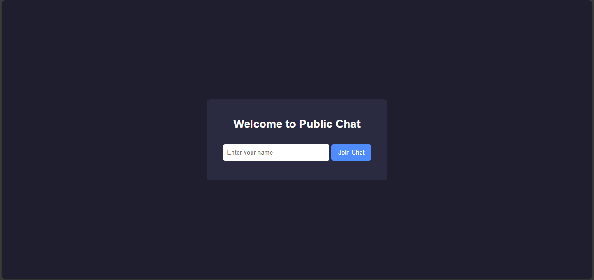
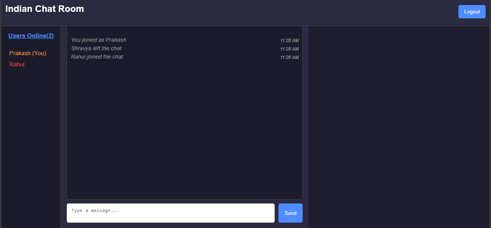
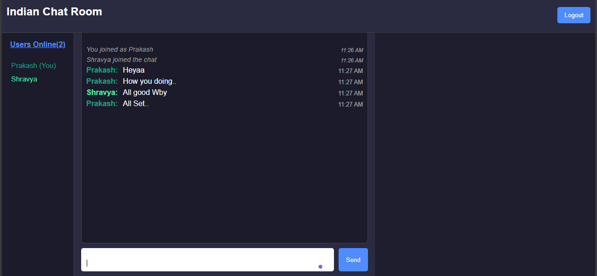
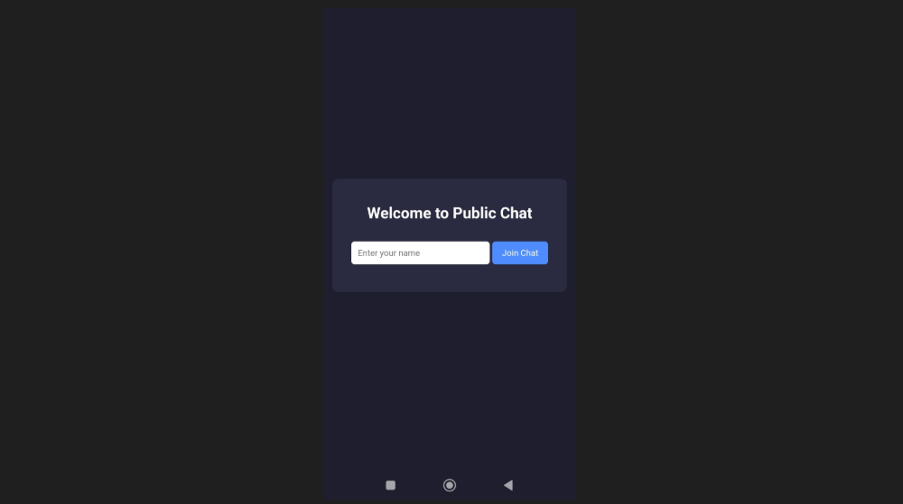
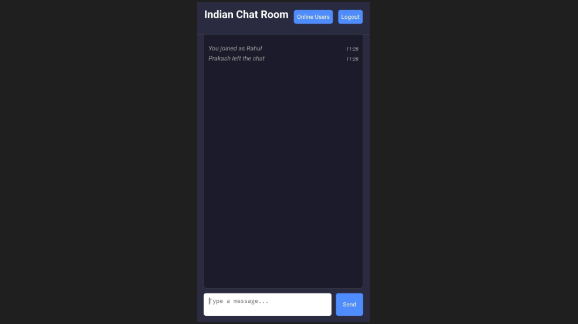
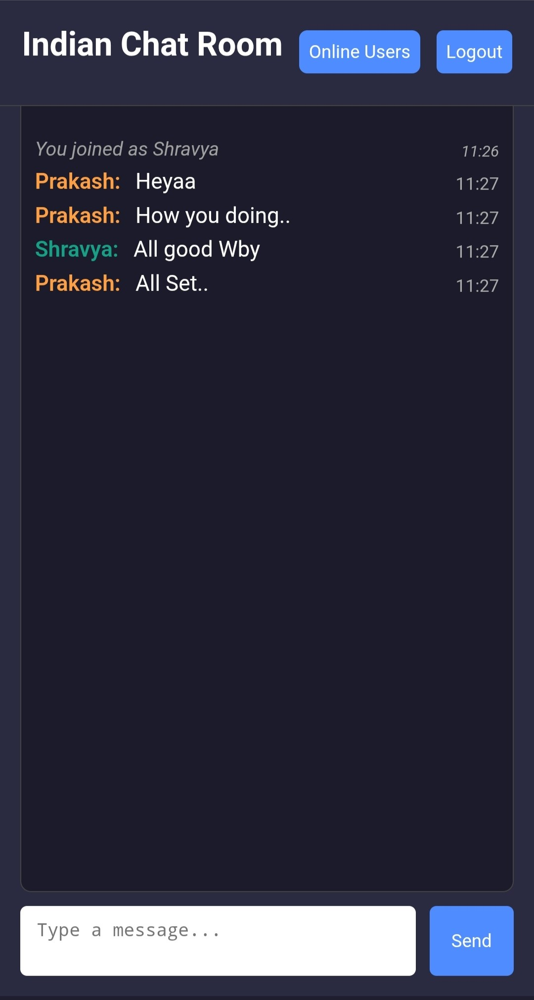

<h1 align="center">🌐 Public Chat App</h1>

<p align="center">
  <strong>A real-time public chatroom built using ExpressJS, Node.js, WebSockets & JavaScript.</strong>
</p>

<p align="center">
  
  
  
  
  
</p>

---

## 🚀 Overview

This project is a **real-time WebSocket-based public chat application** built using:

🔥 Node.js
⚡ ExpressJS
🛰 Socket.IO
🎨 HTML + CSS + JavaScript.  

**Flow** -
Users enter their name → socket connects → instantly join a shared public chat room.

This app lets users instantly join a public chat room, type messages, see join/leave updates, and view real-time online user count.

---

## 🚀 Live Demo

🔗 [Click here to view the deployed Public Chat Room project](https://public-chat-app-s4m5.onrender.com/)


## 📸 Screenshots 

- Desktop Screen 
### 🔹 Home – Enter Username  


### 🔹 Public Chat  




- Mobile Screen

### 🔹 Home – Enter Username  


### 🔹 Public Chat  



---

## ✨ Features

- ⚡ Real-time messaging using WebSockets  
- 🔔 Shows when someone joins or leaves
- ✔ “You joined” and “System” messages
- 👥 Shows **online users count**  
- 🎨 Clean UI (mobile-friendly)
- 📡 Auto-scroll chat  
- 💬 Shows your own name in your window   
- ❤️ Built with love by **Prakash**

---

## 🛠️ Tech Stack

### **Frontend**
- HTML  
- CSS  
- JavaScript

### **Backend**
- Node.js  
- Express.js  
- WS (WebSocket Library)

---

## 📂 Project Structure

```

public-chat-app/
│
├── public/
│ ├── index.html
│ ├── chat.html
│ ├── styles.css
│ └── script.js
│
├── server.js
├── package.json
└── README.md

```


---

## ⚙️ Installation

### 1️⃣ Clone the Repository
```bash
git clone https://github.com/prakashverma-dev/public-chat-app.git
cd public-chat-app
```

### 2️⃣ Install Dependencies
```
npm install
```
### 2️⃣ Set upEnvironment Variables 

- create .env file in the main root folder and add these variables
     #### PORT = 5000

### 3️⃣ Start Local Server   
```
npm start
```

## 🤝 Contributing 

Pull requests are welcome.
For major changes, please open an issue first to discuss what you’d like to change.

## 📜 License

MIT License

## 

<h3 align="center">✨ Built with love by Prakash ❤️</h3> 

